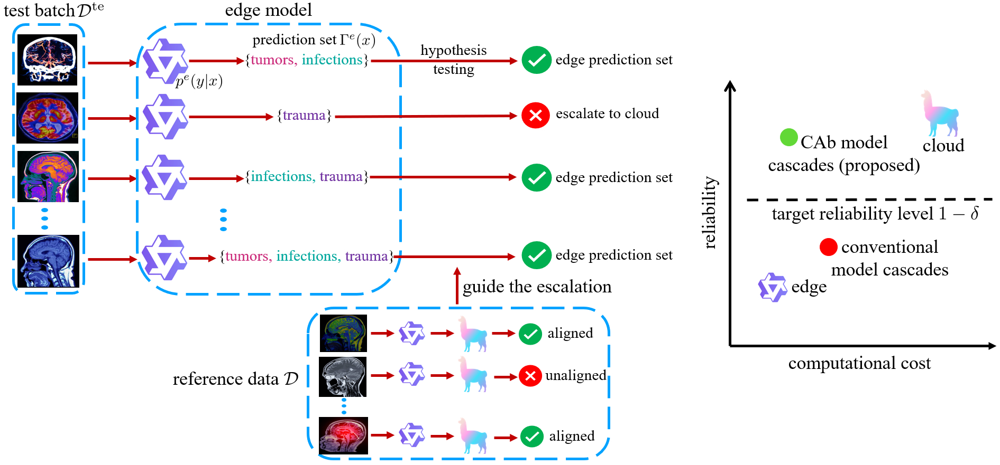

# Reliable Inference in Edge-Cloud Model Cascades via Conformal Alignment

[](https://arxiv.org/pdf/2510.17543)
[](https://pytorch.org/)
[](https://github.com/torrvision/focal_calibration/blob/main/LICENSE)

This repository contains the code for [*Reliable Inference in Edge-Cloud Model Cascades
via Conformal Alignment*](https://arxiv.org/pdf/2510.17543), some elements still in progress.

If the code or the paper has been useful in your research, please add a citation to our work:

```
@article{huang2025reliable,
  title={Reliable Inference in Edge-Cloud Model Cascades via Conformal Alignment},
  author={Huang, Jiayi and Park, Sangwoo and Paoletti, Nicola and Simeone, Osvaldo},
  journal={arXiv preprint arXiv:2510.17543},
  year={2025}
}
```

## Summary

Figure: Given a batch of test input $\mathcal{D}^{\text{te}}$, the small-scale edge model generates prediction sets that may deviate from the prediction sets that would have been produced by a large-scale cloud model, failing to meet a target reliability requirement. The proposed method, conformal alignment-based (CAb) model cascading, casts the edge-cloud escalation as a multiple-hypothesis testing (MHT) problem, determining when to trust the edge prediction set based on reference data $\mathcal{D}$. CAb controls the fraction of edge-generated prediction sets that satisfy conditional coverage conditions, while minimizing the deferral rate to the cloud model.


## Dependencies

The code is based on PyTorch and requires a few further dependencies, listed in [env.yml](env.yml). It should work with newer versions as well.

### Datasets

The *image* dataset, i.e., CIFAR-100, will be downloaded directly on running the code. However, the *question answering* (QA) dataset, i.e., [TeleQnA](https://huggingface.co/datasets/netop/TeleQnA), needs to be downloaded separately for the data loader to work. For convenience, the TeleQnA dataset in JSON format is provided as [teleqna.json](./qa/teleqna.json) within the [qa](./qa) folder.

## Evaluation of a model
To facilitate the reproduction of our results, we provide the inference outputs along with the corresponding details, as follows:

(1) For the *image classification* task, we use the CIFAR-100 dataset, with a *Bayesian WideResNet-40-2* network and a *standard WideResNet-40-2* model as the cloud and edge model, respectively. The inference results can be found in [cifar100_inference_results.pt](./cifar100/cifar100_inference_results.pt) within the [cifar100](./cifar100) folder.

(2) For the *QA* task, we consider the TeleQnA dataset, with language models *Qwen2-7B-Instruct* and *Qwen2-1.5B-Instruct* as the cloud and edge model, respectively, without fine-tuning. Treating the LLMs as black boxes, we approximate the cloud conditional distribution $p^*(y|x)$ and edge conditional distribution $p^e(y|x) by randomly sampling 10 answers per question. To ensure calibrated estimation, we incorporate permutation skill by shuffling the order of options for each question during sampling.

The initial inference results generated by the LLMs are available in [Qwen_Qwen2-1.5B-Instruct_permutation_results](./qa/Qwen_Qwen2-1.5B-Instruct_permutation_results) and [Qwen_Qwen2-7B-Instruct_permutation_results](./qa/Qwen_Qwen2-7B-Instruct_permutation_results) within the [qa](./qa) folder. Additionally, the processed tensor results for [4 questions-options](./qa/4options) and [5 questions-options](./qa/5options) pairs are provided within the [qa](./qa) folder. 

## Conformal alignment-based (CAb) model cascading
In order to reproduce the results presented in this paper, one can run ```python ./CAb.py``` with different parameter settings as described below.

| Argument    | Type    | Default | Description                                                                                                        |
| ----------- | ------- |---------|--------------------------------------------------------------------------------------------------------------------|
| `--dataset` | `str`   | `'qa'`  | Specifies the dataset to use for the experiment. Supported options include `qa` (TeleQnA) and `cifar` (CIFAR-100). |
| `--alpha`   | `float` | `0.2`   | User-defined miscoverage level controlling the target conditional coverage probability.                            |
| `--sigma`   | `float` | `20`    | Gaussian kernel bandwidth parameter for localized conformal prediction (LCP).                                      |
| `--delta`   | `float` | `0.1`   | Target tolerated violation level for the average satisfaction rate.                                               |

### Example usage
For instance, to obtain the selection results on the CIFAR-100 dataset using a user-defined miscoverage level $\alpha=0.2$, Gaussian kernel bandwidth for LCP $\sigma=20$, and target tolerated violation level for the average satisfaction rate $\delta=0.1$, one can run the following command:
```
python ./CAb.py --dataset: cifar --alpha: 0.2 --sigma: 20 --delta: 0.1
```
By utilizing the inference results introduced for the CIFAR-100 dataset, this configuration reproduces the CAb model cascading behavior under the specified settings. 

## Questions

If you have any questions or doubts, please feel free to open an issue in this repository or reach out to me at the provided email addresses: jiayi.3.huang@kcl.ac.uk .
